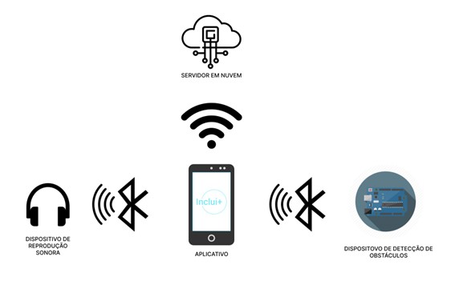
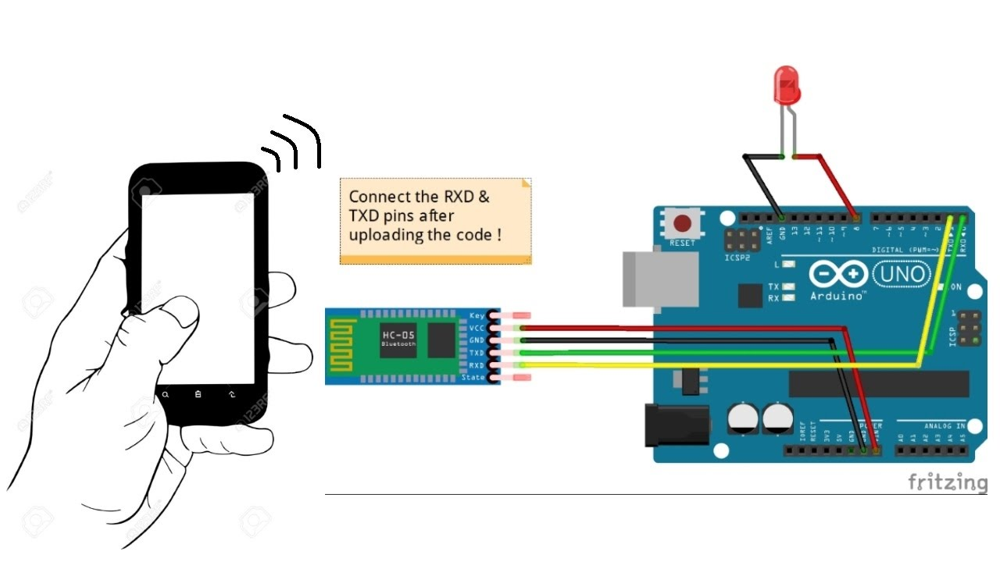
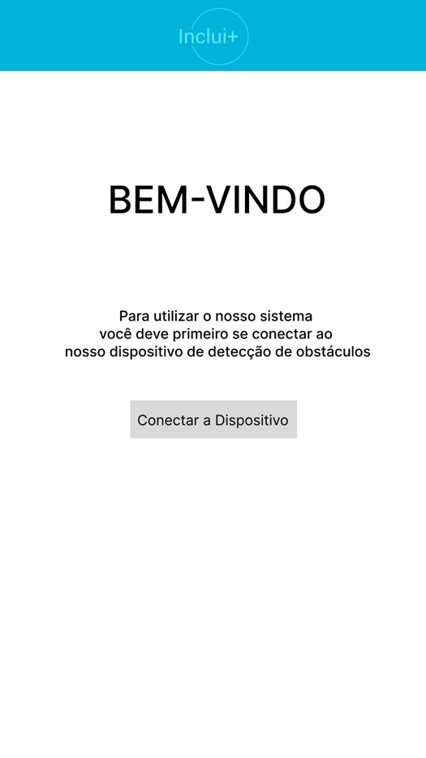
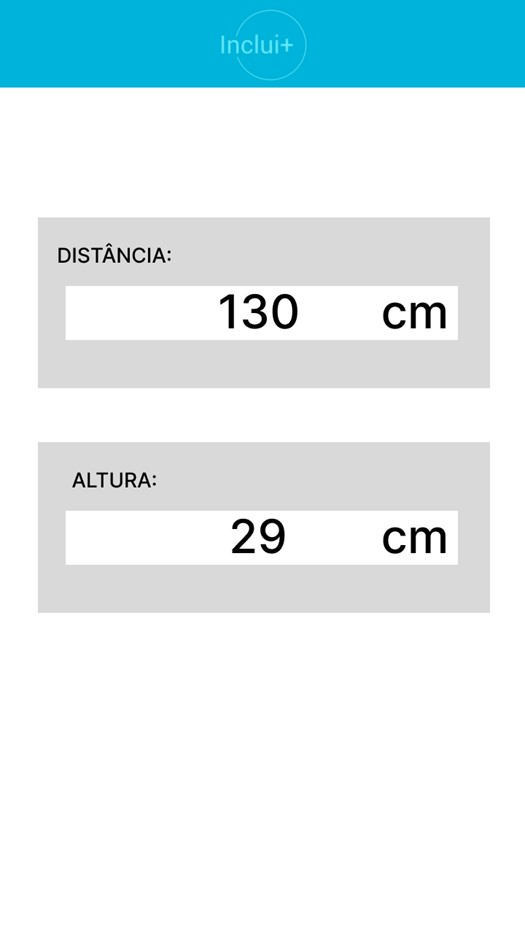

# Sistema de navegação para PCD Visuais
Equipe
---
NOME | RM
:-----:|:---:
Gabriel Machado Belardino|550121
Ana Beatriz Farah Alvez|97865
Kaiky Alvaro de Miranda|98118
Lucas Rodrigues da Silva|98344
Pedro Henrique Bicas Couto|99534
---


O Inclui+ desenvolveu um sistema de navegação de pessoas com deficiência visual, do qual se consiste em um sensor de distancia que deve ser disposto nos ombros ou na cabeça do usuário do qual poderá ser notificado sobre obstáculos presentes no seu caminho.

Para acessar o modelo do tinkerCad [Clique aqui](https://www.tinkercad.com/things/9lrOj3GNvcq)

---
DRAFT
===

---
MONTAGEM DO DISPOSITIVO
==============
#### Materias Necessários Para a Montagem do Sistema
|             Componente             | quantidade |                                                  Descrição                                                   |
| :--------------------------------: | :--------: | :----------------------------------------------------------------------------------------------------------: |
|     **Placa Base Arduino UNO**     |     1      |                 Vai receber as informações do sensor e redirecionar os dados para o celular                  |
|          **Servo Motor**           |     1      |                           Utilizado para posicionar o *HC-SR04* no angulo correto                            |
|  **Sensor ultrassônico(HC-SR04)**  |     1      |                          Responsável por detectar obstáculos na direção do usuário                           |
| **Modulo Bluetooth (HC-05/HC-06)** |     1      | Será utilizado para realizar uma conexão com o celular e enviar os dados de obstáculos no caminho do usuário |


#### Modelo de Montagem


#### Implementação do Código
O codigo pode ser copiado do arquivo: [code](./code.cpp)
Para configurar as medidas utilizadas(Altura, Distancia Desejada e Tolerancia do sensor) podem ser alteradas por meio do serial monitor ou pelo bluetooth enviando o seguinte JSON: 
```JSON
{
    "height":175,
    "wantedDistance":200,
    "tolerance":10
}
```
**As medidas devem ser em _cm_**

#### Regras
* O Servo Motor deve Ser conectado no pino 9 ou 10
* O sensor ultrassonico deve ser acoplado ao Servo motor
* A conexão do ***Modulo Bluetooth*** deve ser conectado somente apos salvar o código no Arduino
* O TR do ***Modulo Bluetooth*** deve se conectar com o TX do Arduino
* O TX do ***Modulo Bluetooth*** deve se conectar com o TR do Arduino


---
FUNCIONAMENTO
====
O sensor de distancia ultrassônico aponta para o chão ate a distancia definida no sistema, criando um angulo que é gerenciado pelo servo motor, dessa forma cria uma figura de um triangulo retângulo:

Dessa forma, é possível detectar um objeto que entre no raio do sensor ultrassônico e calcular a distancia dele em relação ao usuário e alertá-lo da obstrução.


---
Aplicativo
===
Esses dados vão ser enviados para o dispositivo Android conectado pelo Bluetooth.

Em nosso aplicativo, esses dados serão convertidos em bips sonoros que podem ser reproduzidos pelo próprio dispositivo ou outros conectados, como um fone de vibração óssea. 



> Essa é apenas uma tela para demostrar os dados que ele vai analisar. O objetivo é que o aplicativo rode em segundo plano reproduzindo apenas o bipes para o usuário.

O intervalo dos bips vai diminuir proporcionalmente em relação a distancia do objeto detectado.

O Aplicativo Android pode ser encontrado no seguinte repositorio: [Inclui++ APP](https://github.com/The-Challengers04/Inclui-_EDGE_Android_App)


